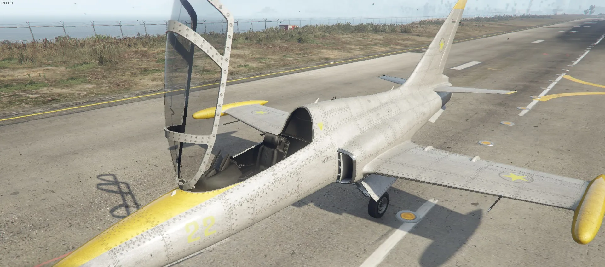
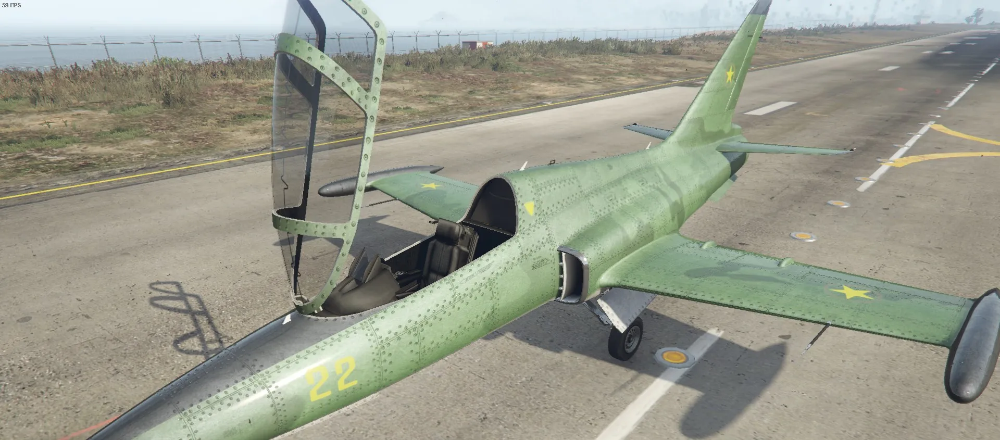
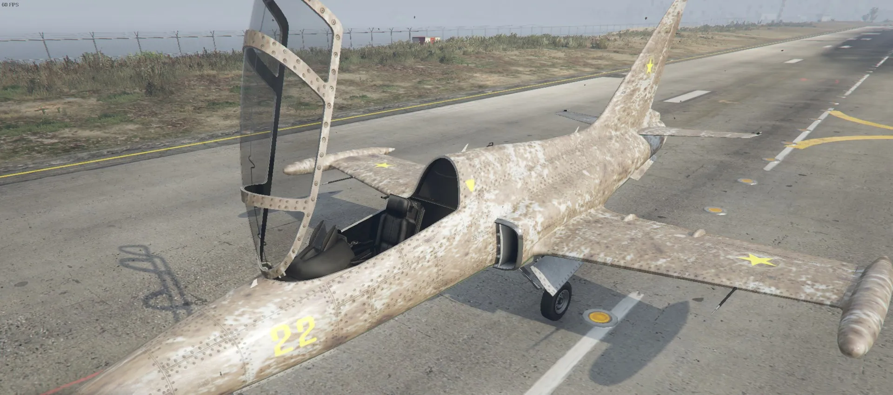

## SET_VEHICLE_ENVEFF_SCALE

```c
// 0x3AFDC536C3D01674 0x8332730C
void SET_VEHICLE_ENVEFF_SCALE(Vehicle vehicle, float fade);
```

Examples with a besra:

- fade value `0.0`:


- fade value `0.5`:


- fade value `1.0`:



The parameter fade is a value from 0-1, where 0 is fresh paint.

## Parameters
* **vehicle**: Target vehicle
* **fade**: The paint fade effect strength
